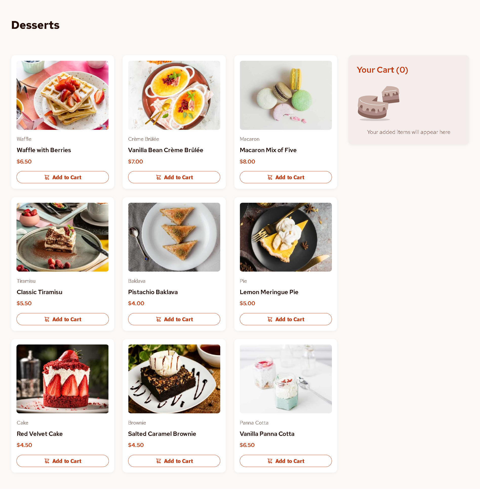

# Frontend Mentor - Product list with cart solution

This is a solution to the [Product list with cart challenge on Frontend Mentor](https://www.frontendmentor.io/challenges/product-list-with-cart-5MmqLVAp_d). 
Frontend Mentor challenges help you improve your coding skills by building realistic projects. 

## Table of contents

- [Overview](#overview)
  - [The challenge](#the-challenge)
  - [Screenshot](#screenshot)
  - [Links](#links)
- [My process](#my-process)
  - [Built with](#built-with)
  - [What I learned](#what-i-learned)
  - [Continued development](#continued-development)
  - [Useful resources](#useful-resources)


## Overview

### The challenge

Users should be able to:

- Add items to the cart and remove them
- Increase/decrease the number of items in the cart
- See an order confirmation modal when they click "Confirm Order"
- Reset their selections when they click "Start New Order"
- View the optimal layout for the interface depending on their device's screen size
- See hover and focus states for all interactive elements on the page

## Screenshot



## Deployment

- Vercel: [Live site](https://product-list-with-cart-coral-kappa.vercel.app/)

## My process

I started simple, beginning with basic HTML and CSS to understand the design requirements and get familiar with the layout structure. Once I had the visual foundation in place, I added interactivity by implementing JavaScript to make the cart functional, allowing users to add and remove items.

As the project grew more complex, I organized the code by breaking down the UI into reusable React components, making the codebase more maintainable and easier to work with. I then made it responsive, ensuring the application worked perfectly on both mobile and desktop devices, providing a great user experience across all screen sizes.

## Built with

- React 18 - Frontend framework
- Vite - Build tool and development server
- JavaScript (ES6+) - Programming language
- CSS3 - Styling with responsive design
- ESLint & Prettier - Code quality and formatting

## What I learned

- How to structure a React application with proper component organization
- Best practices for state management in shopping cart applications
- The importance of responsive design and accessibility
- How to use modern development tools like Vite, ESLint, and Prettier

## The Reducer Pattern

### "Smart organizer"

- You have stuff (state) and want to change it (action)
- The reducer is like a smart assistant that knows exactly how to update your stuff
- It checks what you want to do and applies the right rules
- Keeps everything neat and prevents messes

### Cart example:

- You want to add a dessert
- The reducer checks: "Do I already have this?"
- If yes → just add one more
- If no → add it as new

One smart function that handles all the different ways your app's data can change, keeping everything working smoothly.


```js
function reducer(state, action) {
  switch (action.type) {
    case 'ADD_TO_CART': {
      const exists = state.cartItems.find(
        (item) => item.name === action.payload.name
      );
      if (exists) {
        return {
          ...state,
          cartItems: state.cartItems.map((item) =>
            item.name === action.payload.name
              ? { ...item, quantity: item.quantity + 1 }
              : item
          ),
        };
      }
      return {
        ...state,
        cartItems: [...state.cartItems, { ...action.payload, quantity: 1 }],
      };
    }
```


## Continued development

### Next Steps:

I'm planning to migrate this project to TypeScript for enhanced type safety and better developer experience. 

This will involve:

- Converting all .jsx files to .tsx
- Adding proper type definitions for components and state
- Implementing interfaces for product data and cart actions
- Setting up TypeScript configuration with strict mode
- Adding type checking to the build process

Benefits of TypeScript:

- Catch errors at compile time instead of runtime
- Better IDE support with autocomplete and refactoring
- Improved code documentation through types
- Enhanced team collaboration with clear contracts
- More maintainable codebase as the project grows

## Useful resources

- [Learning React](https://react.dev/learn) - Official Guide
- [Learning Vite](https://vite.dev/guide) - Official Guide
- [Mozilla JavaScript Docs](https://developer.mozilla.org/en-US/docs/Web/JavaScript)


